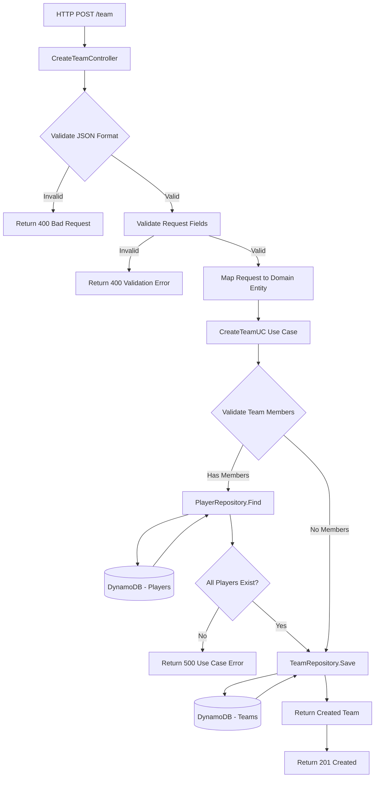

# Use Case: Create Team

## 1. Use Case Identification

**Name**: Create Team  
**Business Goal**: Allow the creation of a new sports team with specified members, sport type, and skill category  
**HTTP Endpoint**: `POST /team`

## 2. Description

### What does this use case do?

This use case enables the creation of a new sports team in the system. It accepts team information including the sport type, team name, skill category, and a list of player IDs who will be members of the team.

### Inputs Required

The endpoint accepts a JSON payload with the following fields:

- **sport** (string, required): The type of sport. Must be one of: `Football`, `Paddle`
- **name** (string, required): The name of the team
- **category** (integer, optional): Skill level category (0-7, where 0 is Unranked and 1-7 represent skill levels L1-L7)
- **players** (array of strings, optional): List of player IDs who are members of this team

### Expected Outputs

On successful creation, the API returns:
- **HTTP Status**: `201 Created`
- **Response Body**: A JSON object containing the complete team entity with all its properties including:
  - Team name
  - Sport type
  - Category
  - Statistics
  - List of team members with their details

### Validations Performed

1. **Request Format Validation**: Ensures the JSON payload is properly formatted
2. **Field Validation**:
   - `sport` must be present and one of the allowed values (`Football`, `Paddle`)
   - `name` must be present and non-empty
   - `category` must be between 0 and 7 if provided
3. **Member Validation**: If player IDs are provided, the system verifies that all players exist in the database

### Business Rules Enforced

1. **Player Existence**: All team members must be existing players in the system
2. **Complete Member Validation**: If the number of players found doesn't match the number of IDs provided, the operation fails
3. **Sport Constraint**: Teams are associated with a specific sport and cannot be multi-sport

## 3. Component Interaction Diagram



## 4. Request/Response Examples

### Success Case - Create Team with Members

```bash
curl -X POST http://localhost:8080/team \
  -H "Content-Type: application/json" \
  -d '{
    "sport": "Paddle",
    "name": "Thunder Strikers",
    "category": 3,
    "players": ["player-001", "player-002", "player-003", "player-004"]
  }'
```

**Response (201 Created)**:
```json
{
  "Name": "Thunder Strikers",
  "Category": 3,
  "Stats": {
    "Wins": 0,
    "Losses": 0,
    "Draws": 0
  },
  "Sport": "Paddle",
  "Members": [
    {
      "ID": "player-001",
      "Category": 3,
      "Sport": "Paddle"
    },
    {
      "ID": "player-002",
      "Category": 3,
      "Sport": "Paddle"
    },
    {
      "ID": "player-003",
      "Category": 4,
      "Sport": "Paddle"
    },
    {
      "ID": "player-004",
      "Category": 2,
      "Sport": "Paddle"
    }
  ]
}
```

### Success Case - Create Team without Members

```bash
curl -X POST http://localhost:8080/team \
  -H "Content-Type: application/json" \
  -d '{
    "sport": "Football",
    "name": "Red Dragons",
    "category": 5
  }'
```

**Response (201 Created)**:
```json
{
  "Name": "Red Dragons",
  "Category": 5,
  "Stats": {
    "Wins": 0,
    "Losses": 0,
    "Draws": 0
  },
  "Sport": "Football",
  "Members": []
}
```

### Error Case - Missing Required Field

```bash
curl -X POST http://localhost:8080/team \
  -H "Content-Type: application/json" \
  -d '{
    "sport": "Paddle",
    "category": 3
  }'
```

**Response (400 Bad Request)**:
```json
{
  "error": {
    "code": "VALIDATION_ERROR",
    "message": "Field validation for 'Name' failed on the 'required' tag"
  }
}
```

### Error Case - Invalid Sport Type

```bash
curl -X POST http://localhost:8080/team \
  -H "Content-Type: application/json" \
  -d '{
    "sport": "Basketball",
    "name": "Hoops Masters",
    "category": 2
  }'
```

**Response (400 Bad Request)**:
```json
{
  "error": {
    "code": "VALIDATION_ERROR",
    "message": "Field validation for 'Sport' failed on the 'oneof' tag"
  }
}
```

### Error Case - Non-Existent Player

```bash
curl -X POST http://localhost:8080/team \
  -H "Content-Type: application/json" \
  -d '{
    "sport": "Football",
    "name": "Super Team",
    "category": 4,
    "players": ["player-999", "player-888"]
  }'
```

**Response (500 Internal Server Error)**:
```json
{
  "error": {
    "code": "USE_CASE_EXECUTION_FAILED",
    "message": "some of the team member does not exist"
  }
}
```

### Error Case - Invalid JSON Format

```bash
curl -X POST http://localhost:8080/team \
  -H "Content-Type: application/json" \
  -d '{
    "sport": "Paddle",
    "name": "Team Name"
    "category": 1
  }'
```

**Response (400 Bad Request)**:
```json
{
  "error": {
    "code": "INVALID_REQUEST_FORMAT",
    "message": "Invalid request format"
  }
}
```

## 5. Error Handling

### Error Codes and Meanings

| Error Code | HTTP Status | Description | When It Occurs |
|------------|-------------|-------------|----------------|
| `INVALID_REQUEST_FORMAT` | 400 | The request body is not valid JSON or cannot be parsed | Malformed JSON in request body |
| `VALIDATION_ERROR` | 400 | One or more fields failed validation | Required fields missing, invalid enum values, out-of-range values |
| `USE_CASE_EXECUTION_FAILED` | 500 | Business logic validation failed or database operation error | Team members don't exist, database connection issues |

### Common Error Scenarios

1. **Missing Required Fields**: Returns 400 with specific field that failed validation
2. **Invalid Sport Type**: Returns 400 indicating the sport must be one of the allowed values
3. **Invalid Category**: Returns 400 if category is outside the 0-7 range
4. **Non-Existent Players**: Returns 500 with message "some of the team member does not exist"
5. **Database Errors**: Returns 500 with generic error message
6. **Malformed JSON**: Returns 400 with "Invalid request format" message

### Error Response Structure

All errors follow a consistent structure:

```json
{
  "error": {
    "code": "ERROR_CODE",
    "message": "Human-readable error description"
  }
}
```

