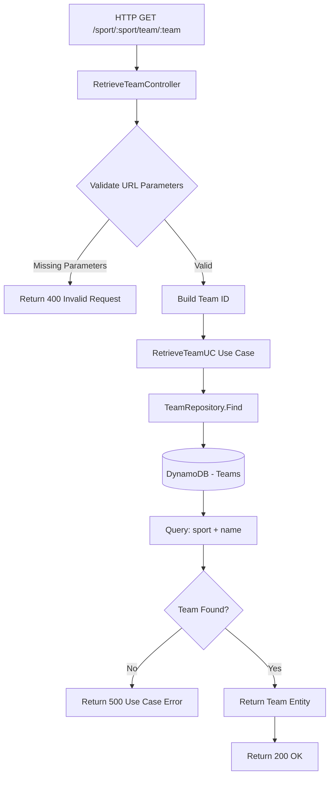

# Use Case: Retrieve Team

## 1. Use Case Identification

**Name**: Retrieve Team  
**Business Goal**: Retrieve detailed information about a specific team by sport type and team name  
**HTTP Endpoint**: `GET /sport/:sport/team/:team`

## 2. Description

### What does this use case do?

This use case retrieves comprehensive information about a specific sports team. It searches for the team using both the sport type and team name as identifying parameters.

### Inputs Required

The endpoint accepts URL path parameters:

- **sport** (string, required): The type of sport (e.g., `Football`, `Paddle`, `Tennis`)
- **team** (string, required): The name of the team to retrieve

### Expected Outputs

On successful retrieval, the API returns:
- **HTTP Status**: `200 OK`
- **Response Body**: A JSON object containing the complete team entity including:
  - Team name
  - Sport type
  - Skill category
  - Team statistics (wins, losses, draws)
  - Complete list of team members with their profiles

### Validations Performed

1. **Parameter Validation**: Ensures both sport and team name parameters are present and non-empty
2. **Sport Type Validation**: Verifies the sport parameter is a valid sport type
3. **Team Existence**: Checks if a team with the given name exists for the specified sport

### Business Rules Enforced

1. **Sport-Specific Search**: Teams are unique per sport (a team name can exist for different sports)
2. **Exact Name Match**: Team name must match exactly (case-sensitive)
3. **Single Result**: Returns the first matching team if multiple exist

## 3. Component Interaction Diagram



## 4. Request/Response Examples

### Success Case - Retrieve Existing Team

```bash
curl -X GET http://localhost:8080/sport/Paddle/team/Thunder%20Strikers \
  -H "Accept: application/json"
```

**Response (200 OK)**:
```json
{
  "Name": "Thunder Strikers",
  "Category": 3,
  "Stats": {
    "Wins": 15,
    "Losses": 8,
    "Draws": 2
  },
  "Sport": "Paddle",
  "Members": [
    {
      "ID": "player-001",
      "Category": 3,
      "Sport": "Paddle"
    },
    {
      "ID": "player-002",
      "Category": 3,
      "Sport": "Paddle"
    },
    {
      "ID": "player-003",
      "Category": 4,
      "Sport": "Paddle"
    },
    {
      "ID": "player-004",
      "Category": 2,
      "Sport": "Paddle"
    }
  ]
}
```

### Success Case - Retrieve Football Team

```bash
curl -X GET http://localhost:8080/sport/Football/team/Red%20Dragons \
  -H "Accept: application/json"
```

**Response (200 OK)**:
```json
{
  "Name": "Red Dragons",
  "Category": 5,
  "Stats": {
    "Wins": 22,
    "Losses": 3,
    "Draws": 5
  },
  "Sport": "Football",
  "Members": [
    {
      "ID": "player-101",
      "Category": 5,
      "Sport": "Football"
    },
    {
      "ID": "player-102",
      "Category": 5,
      "Sport": "Football"
    },
    {
      "ID": "player-103",
      "Category": 6,
      "Sport": "Football"
    },
    {
      "ID": "player-104",
      "Category": 4,
      "Sport": "Football"
    },
    {
      "ID": "player-105",
      "Category": 5,
      "Sport": "Football"
    }
  ]
}
```

### Success Case - Team with No Members

```bash
curl -X GET http://localhost:8080/sport/Tennis/team/Solo%20Aces \
  -H "Accept: application/json"
```

**Response (200 OK)**:
```json
{
  "Name": "Solo Aces",
  "Category": 2,
  "Stats": {
    "Wins": 0,
    "Losses": 0,
    "Draws": 0
  },
  "Sport": "Tennis",
  "Members": []
}
```

### Error Case - Team Not Found

```bash
curl -X GET http://localhost:8080/sport/Paddle/team/NonExistentTeam \
  -H "Accept: application/json"
```

**Response (500 Internal Server Error)**:
```json
{
  "error": {
    "code": "USE_CASE_EXECUTION_FAILED",
    "message": "index out of range [0] with length 0"
  }
}
```

### Error Case - Missing Sport Parameter

```bash
curl -X GET http://localhost:8080/sport//team/SomeTeam \
  -H "Accept: application/json"
```

**Response (404 Not Found)**:
```
404 page not found
```

### Error Case - Missing Team Parameter

```bash
curl -X GET http://localhost:8080/sport/Football/team/ \
  -H "Accept: application/json"
```

**Response (404 Not Found)**:
```
404 page not found
```

### Error Case - Invalid Sport Type

```bash
curl -X GET http://localhost:8080/sport/Basketball/team/Hoops%20Masters \
  -H "Accept: application/json"
```

**Response (500 Internal Server Error)**:
```json
{
  "error": {
    "code": "USE_CASE_EXECUTION_FAILED",
    "message": "index out of range [0] with length 0"
  }
}
```

## 5. Error Handling

### Error Codes and Meanings

| Error Code | HTTP Status | Description | When It Occurs |
|------------|-------------|-------------|----------------|
| `INVALID_REQUEST_FORMAT` | 400 | One or both URL parameters are missing | Sport or team name parameter is empty |
| `USE_CASE_EXECUTION_FAILED` | 500 | Team not found or database operation error | Team doesn't exist, database connection issues, invalid sport type |
| `404 Not Found` | 404 | Route not matched | Malformed URL with missing path segments |

### Common Error Scenarios

1. **Team Not Found**: Returns 500 with "index out of range" error when team doesn't exist
2. **Invalid Sport Type**: Returns 500 when querying with an unsupported sport
3. **Missing Parameters**: Returns 404 when URL path is incomplete
4. **Database Errors**: Returns 500 with error details
5. **Empty Parameters**: Returns 400 with "Invalid request format" message

### Error Response Structure

Standard errors follow this structure:

```json
{
  "error": {
    "code": "ERROR_CODE",
    "message": "Human-readable error description"
  }
}
```

**Note**: 404 errors return plain text rather than JSON format.

### Known Issues

- **Team Not Found Error**: Currently returns "index out of range" instead of a clear "Team not found" message. This is because the use case doesn't check if the result array is empty before accessing the first element.
- **Invalid Sport Handling**: Invalid sport types result in "index out of range" error rather than a more descriptive error message.

## 6. Additional Notes

### URL Encoding

Team names with spaces or special characters must be URL-encoded:
- Spaces should be encoded as `%20` or `+`
- Special characters should follow standard URL encoding rules

Examples:
- "Thunder Strikers" → "Thunder%20Strikers"
- "FC Barcelona B" → "FC%20Barcelona%20B"

### Case Sensitivity

Team names are **case-sensitive**. Ensure the exact casing matches:
- "Red Dragons" ≠ "red dragons"
- "THUNDER" ≠ "Thunder"

### Performance Considerations

The current implementation:
- Queries DynamoDB using sport and team name filters
- Returns the first matching result
- Includes all team member details in the response
- May have performance implications for teams with many members

