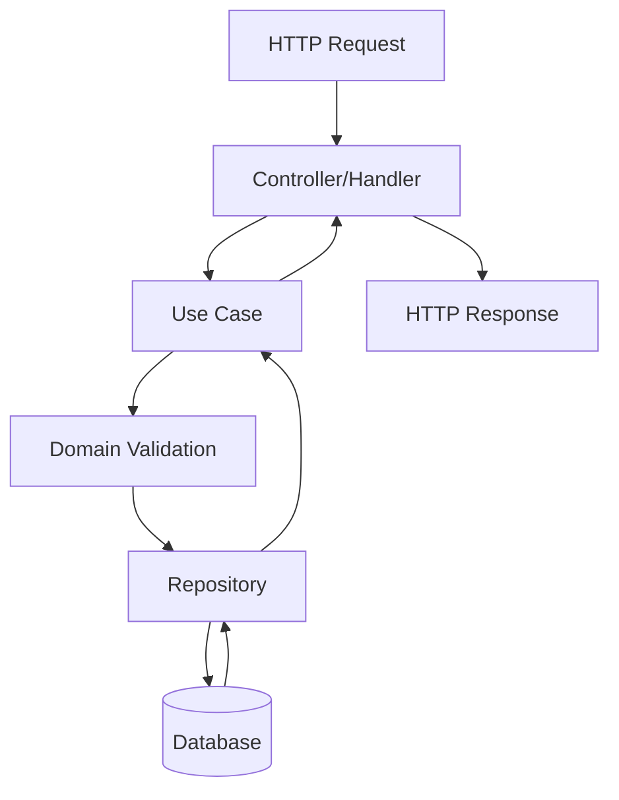

# Documentation Template Guide

This document provides the structure and instructions for generating comprehensive API documentation.

---

## 1. API Overview

**Instructions:** Write a high-level summary of what the API does without entering into technical details. Answer the following questions:

- What is the purpose of this API?
- What business domain does it serve?
- Who are the intended users?
- What are the main capabilities provided?
- What problem does it solve?

**Output Location:** This section should be written in the main `docs/api-overview.md` file.

**Note:** All documentation files must use lowercase names with hyphens (kebab-case), e.g., `api-overview.md`, `use-case-name.md`

---

## 2. Use Cases Documentation

**Instructions:** For each use case in the application, create a dedicated documentation file in the `docs/usecases/` directory following the structure below.

### Use Case Template Structure

Each use case should be documented in its own file: `docs/usecases/<use-case-name>.md`

For each use case, answer the following questions:

#### 2.1 Use Case Identification
- What is the name of this use case?
- What is the business goal or purpose?
- Which HTTP endpoint(s) does it expose?

#### 2.2 Description
- What does this use case do?
- What are the inputs required?
- What are the expected outputs?
- What validations are performed?
- What business rules are enforced?

#### 2.3 Component Interaction Diagram

**Instructions:** Create a Mermaid flowchart showing how the components interact with each other. The diagram should include:

- HTTP Handler/Controller
- Use Case
- Repositories
- Domain Entities
- External Services (if any)
- Database

Example format:


#### 2.4 Request/Response Examples

**Instructions:** Provide curl examples for each use case. Include:

- **Success Case:** A complete curl command with all required parameters
- **Error Cases:** Examples of common error scenarios

Example format:
```bash
# Success Case
curl -X POST http://localhost:8080/api/v1/resource \
  -H "Content-Type: application/json" \
  -d '{
    "field1": "value1",
    "field2": "value2"
  }'

# Error Case - Missing Required Field
curl -X POST http://localhost:8080/api/v1/resource \
  -H "Content-Type: application/json" \
  -d '{
    "field1": "value1"
  }'
```

#### 2.5 Error Handling

**Instructions:** Document the possible errors:
- What error codes can be returned?
- What do they mean?
- Under what conditions do they occur?

---

## 3. Use Case Inventory

**Instructions:** List all identified use cases in the application. For each use case, provide:

1. **Use Case Name**
2. **Brief Description** (1-2 sentences)
3. **Reference Link** to the detailed documentation file

### Identified Use Cases

Create a list like this:

1. **[Use Case Name 1](./usecases/use-case-1.md)**  
   *Brief description of what this use case does*

2. **[Use Case Name 2](./usecases/use-case-2.md)**  
   *Brief description of what this use case does*

3. **[Use Case Name 3](./usecases/use-case-3.md)**  
   *Brief description of what this use case does*

---

## 4. Documentation Generation Checklist

Before considering the documentation complete, verify:

- [ ] API Overview is written and provides a clear understanding of the system
- [ ] All use cases are identified and listed
- [ ] Each use case has its own dedicated file in `docs/usecases/`
- [ ] Each use case file includes:
  - [ ] Clear description
  - [ ] Mermaid diagram showing component interactions
  - [ ] curl examples for success cases
  - [ ] curl examples for error cases
  - [ ] Error handling documentation
- [ ] All links between documents are working
- [ ] All code examples are tested and working

---

## 5. Directory Structure

The final documentation should follow this structure:

```
docs/
├── readme.md                            # Documentation index and navigation
├── api-overview.md                      # High-level API overview
├── api-documentation.md                 # Complete API reference
├── templates/
│   └── summary.md                       # This file (template instructions)
└── usecases/
    ├── create-player.md                 # Individual use case documentation
    ├── create-team.md                   # Individual use case documentation
    ├── retrieve-team.md                 # Individual use case documentation
    └── ...                              # Additional use cases
```

**Important:** All file names must use lowercase letters with hyphens (kebab-case). Never use uppercase letters or underscores in file names.

---

## Notes

- Keep the documentation up to date with code changes
- Use clear and concise language
- Provide realistic examples
- Ensure all curl examples can be copy-pasted and executed
- Diagrams should be simple and focused on the main flow
- Document edge cases and error scenarios

